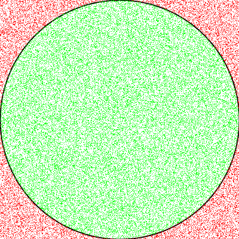

# Approximating value of Pi
Approximating value of Pi using Monte Carlo method.  
Implemented in **Processing**.  

Sample of approximation:  

---

## Contributors

- Yurii Khomiak

---

## License & copyright

© Yurii Khomiak

Licensed under the [MIT License](LICENSE).